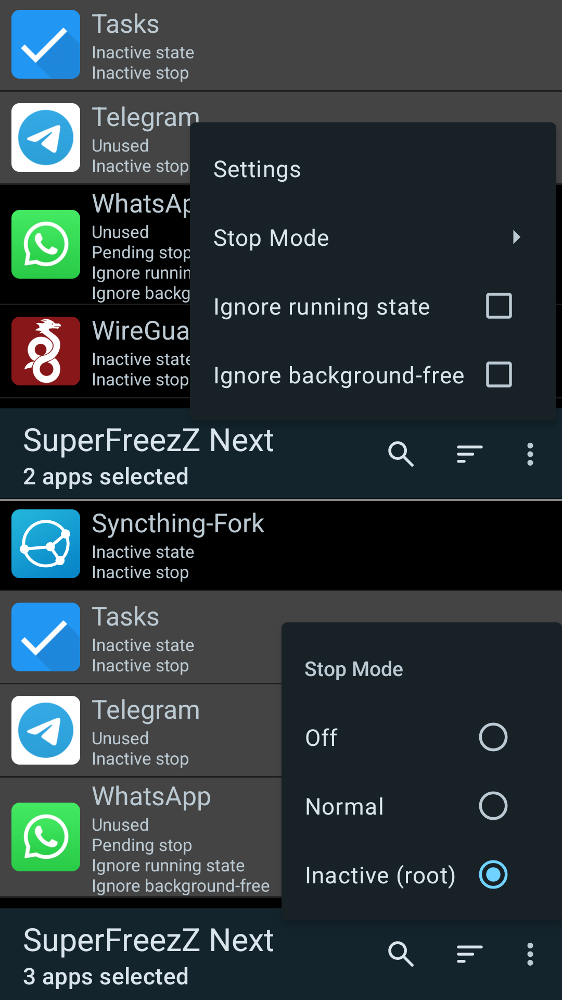
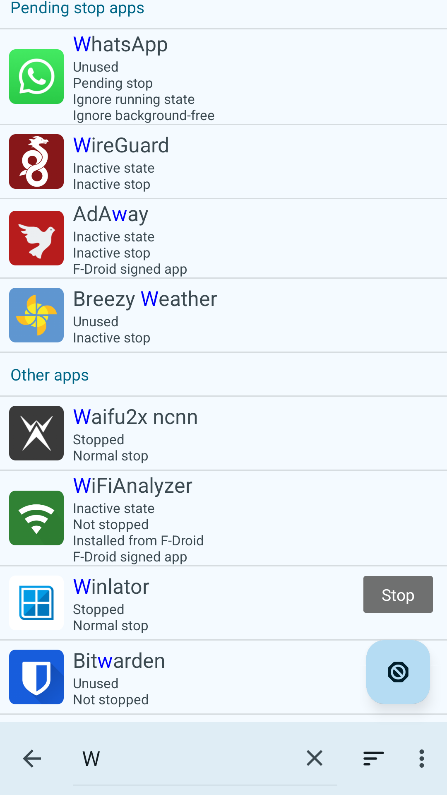
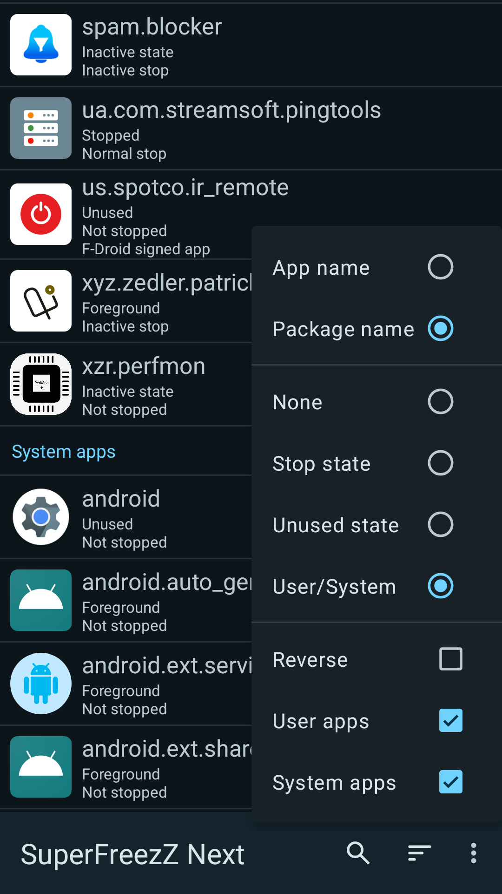
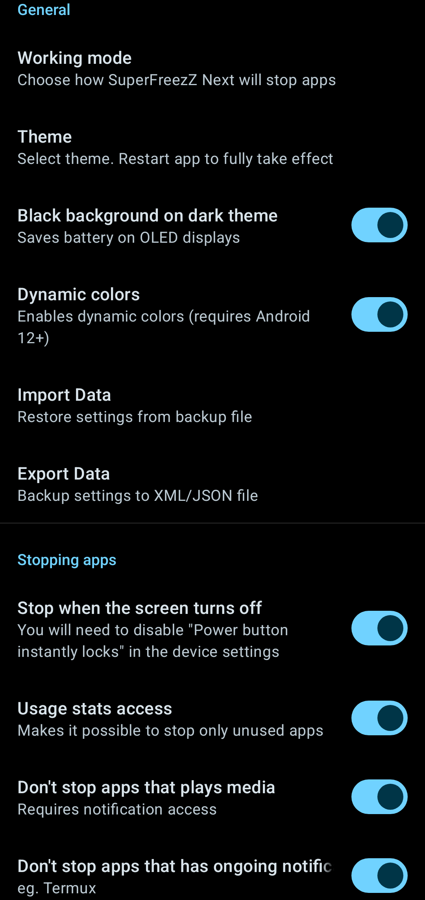

## SuperFreezZ Next
An Android app that makes stopping bad apps easier.
Inspired by Greenify, SuperFreezZ, and Battery Tool

[](https://github.com/mdp43140/SuperFreezZ_Next/actions/workflows/android.yml)
[](/issues)
[](/blob/master/LICENSE)

+ Get back control over what apps runs on your phone
+ Improve battery life and reduce data usage by stopping rarely used apps
+ Especially useful while you are on a travel, where you only need some apps but also want long battery life

Greenify can also do this, but it is not open-source.
SuperFreezZ is open-source, but its outdated now.
Battery Tool only works for rooted users.

### Features/TODO:
+ Completely free and open-source
+ Stop any apps you want
+ Material Design 3
+ Supports Android 7-15
+ Import/Export settings
+ New (and monochrome) logo!
+ Can use root, accessibility, or even doing it manually
+ Built-in Good/Bad apps preset, for less configuration
+ Uses topjohnwu's (Magisk dev) LibSU (newer, much safer)
	instead of ChainFire's Superuser library (outdated, not safe)
	- in the future might use homemade significantly smaller alternative?
+ Better running app detection system (mostly based on Greenify)
	+ Don't stop apps that have persistent notification (eg. Termux, based on
		someone's issue in BatteryTool, maybe based on Greenify too according to them)
	+ Don't stop apps that plays media (based on Greenify)
		- Properly working (bug media player still says playing even if its removed or paused)
	+ Detects apps downloaded from F-Droid (installed from F-Droid, signed by F-Droid)
	- Detects apps that has accesibility service turned on
		(i thought this isnt possible until i saw news that another bank
		app can detect usage of accessibility services of individual apps)
+ Label to section off app lists.
+ (Actually working) non-root accesibility method
	+ Fixed stuck when force stop button is disabled in ColorOS
	+ Temporary workaround: count how many apps will it stop (it does work pretty good)
	- Must launch FreezeShortcutActivity, and send data to it
		That means Parcelizing/Serializing data, which is a NIGHTMARE
		or we can use companion stuff idk
		Refactor AppInfo data class?
		Or maybe use Service instead? (last option sounds legit.)
+ Item selection: Modify/Stop multiple apps
	- Proper implementation? (Fix bug when reloading app item not kept)
+ Properly fix stopping from shortcut
+ Rebase from new template
+ Fix IndexOutOfBounds Inconsistency crash when scrolling and searching at the same time (partially fixed)
- Stop apps after screen turned off
- Add back the on finish freeze listener
- Automate disabling running in background toggle
- Fix 4x bigger RAM Usage compared to other apps
	- maybe use Coil-kt, Picasso, Glide? (Kotlin, Size, Standard)
	- Coil-kt example: https://github.com/TeamNewPipe/NewPipe/pull/11238/files
	- Main cause is app icon, but wy SF has smaller RAM usage then? Also onBackPressed,
		call finish(), because even if it removed from recents, those still eats RAM
- Feature: Disable battery optimization and IGNORE apps from RUN_ANY_IN_BACKGROUND
	(optionally add option in setting to be able to set it to DENY)
- Fix NullPointerException inside AppListAdapter.Thread {} error (how 2 repro:
	set root method (optional, easier method), start kill apps & immediately exit)
- Implement a system where apps with "auto" stop method will
	proritize stop based on battery usage and background time
- Implement a system where if root method used, optionally make apps
	with "auto" stop method inactive stop, then after unused for
	a while (prob 24 hours idk), do a normal stop
- Stop apps that is not used for a specified amount of hours
- Stop apps when the screen turned off
	- Might need to make a new BroadcastReceiver with SCREEN_OFF intent :idk
- Introduction on first launch? (prob have to make IntroActivity)
- Change app name (Important, its not a good idea to use the same name of
	existing app, or the author may throw DMCA takedown notice for being copycat).
- Domi04151309/BatteryTool:
	- Aggressive Doze, root only (cmd deviceidle ...)
	- ignore focused apps, root only
		https://github.com/Domi04151309/BatteryTool/blob/main/app/src/main/java/io/github/domi04151309/batterytool/helpers/Root.kt#L44
	- better playback detection ig
		but pretty long code bruh
		https://github.com/Domi04151309/BatteryTool/blob/main/app/src/main/java/io/github/domi04151309/batterytool/services/NotificationService.kt#L35
		TL;DR: instead of using event listener, we grab and process it in place
		+ Less battery usage because doesnt run when not requested
		- slightly convoluted code

### Screenshots





### Download:
- [F-Droid (TODO, not yet)](https://f-droid.org/packages/io.mdp43140.superfreeze_next)
- [GitHub](https://github.com/mdp43140/SuperFreezZ_Next)
- [Codeberg (TODO, not yet)](https://codeberg.org/mdp43140/SuperFreezZ_Next)

SuperFreezZ Next is not yet another "magic speed booster" on play store that promises to
delete 10 GB of data per month or making your device 2x faster. This is impossible.

Instead, SuperFreezZ Next is honest about its disadvantages:
Stopping daily used apps probably drains your battery a little faster.
Also, these apps will take longer to start when you use them the next time:
SuperFreezZ Next will super freeze your apps, it takes about 1-3 seconds to un-freeze them.
Greenify has the same disadvantages, except that the author doesn't warn you about it.
So: Just do not overdo it, and SuperFreezZ Next will be super useful.

SuperFreezZ Next do implement a feature called "inactive stop"
(based on Greenify's shallow hibernation, name inspired from `am set-inactive PACKAGE true`)
where it doesnt fully stop the app, still able to receive notification from
your important application in background, and also enjoy faster startup speed,
but you'll need root access for this to work.

### Examples for apps that deserve to be stopped:
 * Untrusted apps (that you do not want to run in the background)
 * Apps you rarely use
 * Annoying apps (eg. Social medias like Facebook, Instagram, TikTok)

### Compiling the app
First, export some variables (for Linux users. Windows user might want to adjust this a bit):

```bash
export JAVA_HOME="${JAVA_HOME:-/usr/lib/jvm/java-21-openjdk-amd64}"
export ANDROID_SDK_ROOT="${ANDROID_SDK_ROOT:-~/.android/SDK}"
```

Then go to the project root directory, and run this command:

```bash
./gradlew :app:assembleRelease
```

if you're using Windows, change `./gradlew` to `gradlew.bat`

### Contributing

If you have a problem, question or an idea, just open an issue!

If you would like to help with developing, have a look at the issues, or think of something that could be improved, and open an issue for it.

Please tell me what you are going to do, to avoid implementing the same thing at the same time :-)

### Credits
- mdp43140 - 2025 (Big refactor)
- Hocuri - 2018-2019 (Majority of previous codes)

### License
[](https://www.gnu.org/licenses/gpl-3.0.en.html)

SuperFreezZ Next is Free Software: You can use, study, share, and improve it at
will. Specifically you can redistribute and/or modify it under the terms of the
[GNU General Public License](https://www.gnu.org/licenses/gpl.html) as
published by the Free Software Foundation, either version 3 of the License, or
(at your option) any later version.
